# Flashcard-o-matic

This app is a memory drill tool for students.  It allows the adding, viewing, editing, deleting, and saving of any number of subject-themed card groups ("decks") and cards within them.  A deck must have at least three cards to be studied.   
 It uses an API to create, read, update, and delete records stored by the API.   
This was a capstone project for the Thinkful Engineering course, to demonstrate use of React, especially rendering, managing state, calling external APIs, and using React Router, with emphasis on state management and definition of routes with URLs.
 
## Links

* [Alas, not yet a link, just a placeholder!](https://placeholder)

## Screenshots

### Home

The app starts here and displays all current decks:

### Study Deck

When user clicks `Study`--assuming the deck has enough cards--user is taken to the `Study` view, and is shown the "front" of the first card:

After user clicks `flip` on the front-of-card view, user is shown the "back" of the same card:

When user clicks `next`, user is taken to the front side of the next card in the deck:

After having viewed all cards in the deck, user is given the choice of restarting the same deck, or returning Home:

If, from the home screen, user tries to study a deck with less than three cards, user is informed that there are not enough cards to study, and is presented with a button which will take user to the `Add Card` screen:

### Add Card

On this screen the user may enter, via text areas, the front and back text for a new card.  If user clicks `Done`, the card-adding process ends without saving and user is returned Home:

If the user clicks `Save`, the card is saved and another blank form is presented for entry of yet another card.  This process will repeat until user clicks `Done` (or `Home` in the navigation bar):

###"Deck" View

Once user has clicked `Done`, user is taken to the `Deck` view.  Here the new card can be seen appended to what was present before:

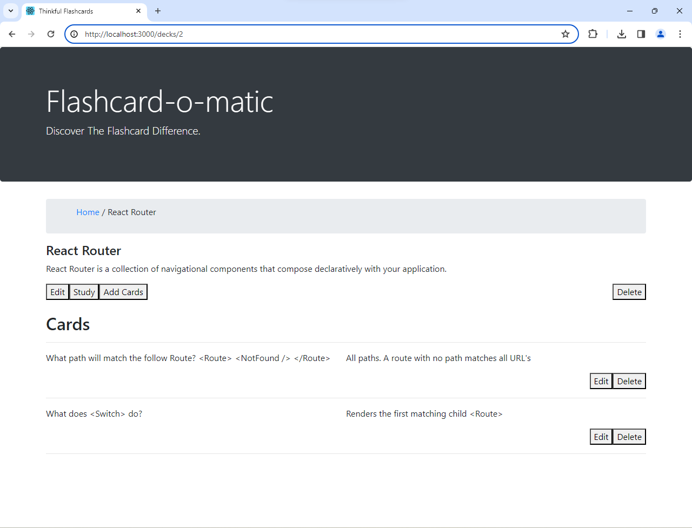

From this view, user may choose to `study` deck, `add cards` to a deck, `edit` or `delete` a deck, or `edit` or `delete` a card.

###Edit Card

Here is the `Edit Card` view.  It looks very much like the `Add Card` view, because both views use a shared component (`CardForm`) which renders content conditionally:

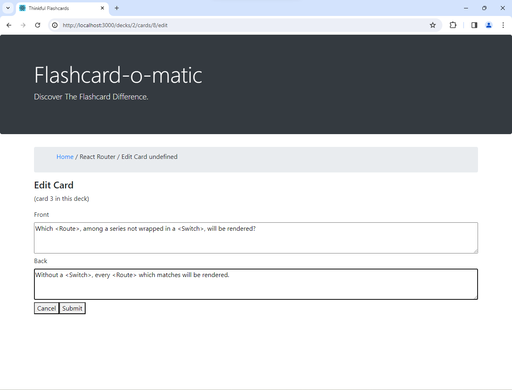

Clicking `Cancel` returns user to the `Deck` view.  Clicking `Submit` saves the changes first, then also returns user to `Deck` view.  

In this example, we have made and submitted edits and have been returned to the `Deck` view where we can see the recent changes reflected in what is now displayed:

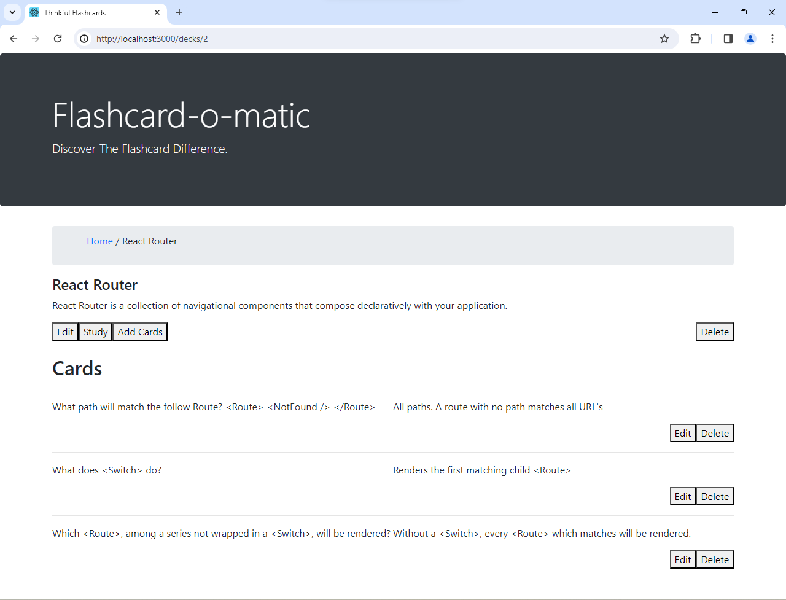

Similarly, we can also navigate via the `Home` nav link back Home and see the changes reflected there as well, where our second deck now has three cards instead of two:

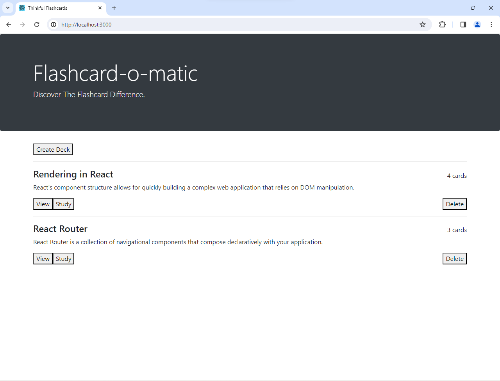

###Create Deck

If, from Home, user were to click `Create Deck`, user would be taken to this `Create Deck` view:

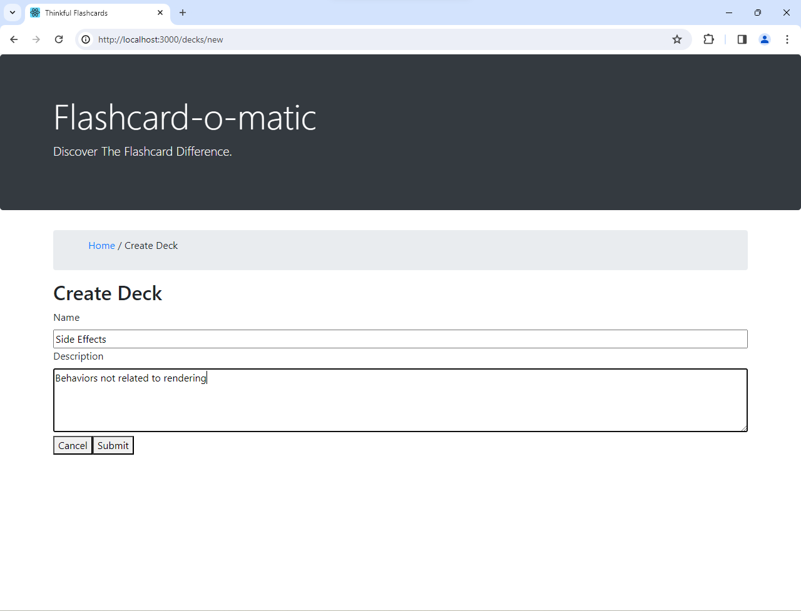

After creation of a new deck, user is again directed to `Deck` view, where the new deck is visible but, as yet, only has a title and description without any cards:

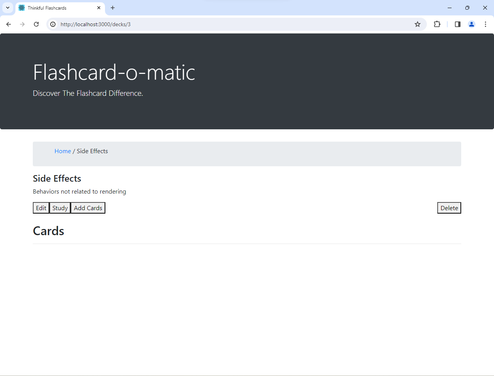

And this would be the `Home` view with our new (empty) deck present:

###Edit Deck

If, from the `Deck` view, user clicks `Edit` Deck, user is taken to the `Edit Deck` view, where user may alter the deck's title and description:

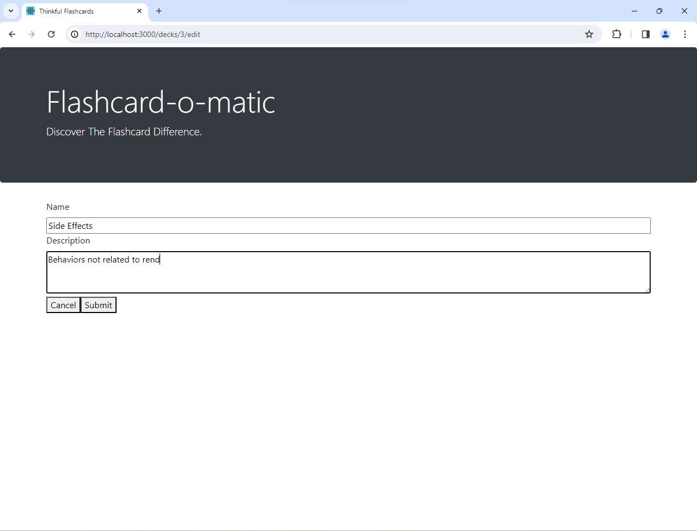

If, from within the `Deck` view, user clicks `Delete` card, user is first prompted to confirm this decision:

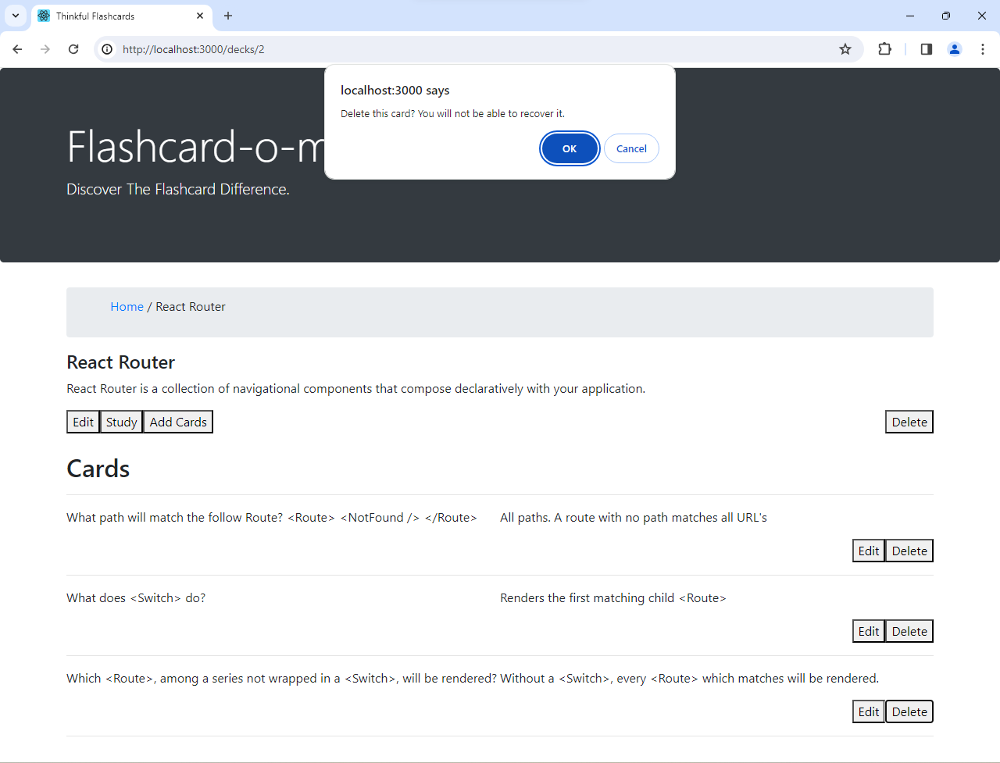

Now that we user has confirmed choice to delete the card, the `Deck` view shows us back down to just two cards in that deck:

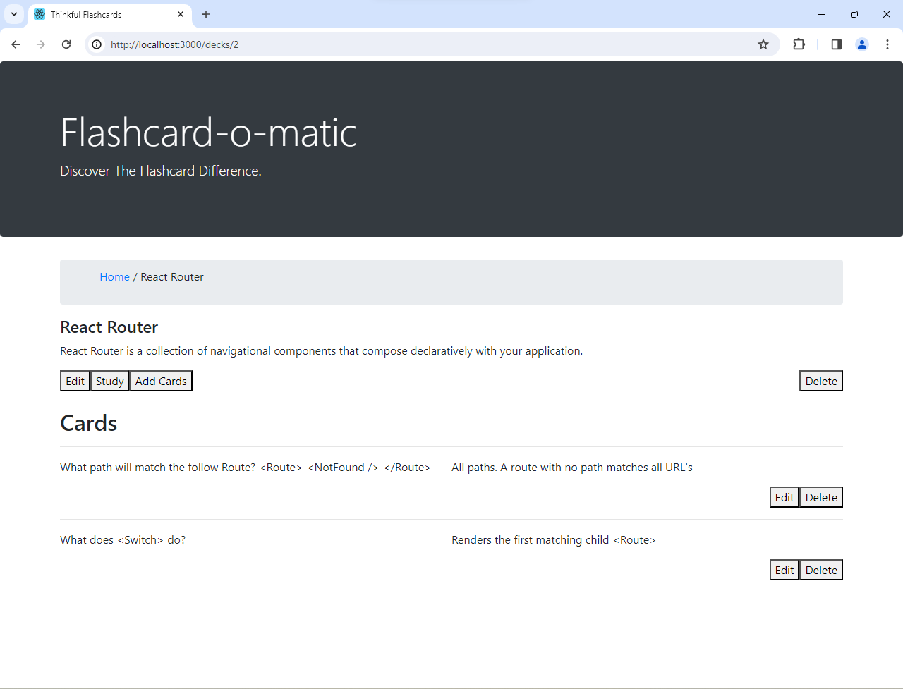

Likewise with Home:

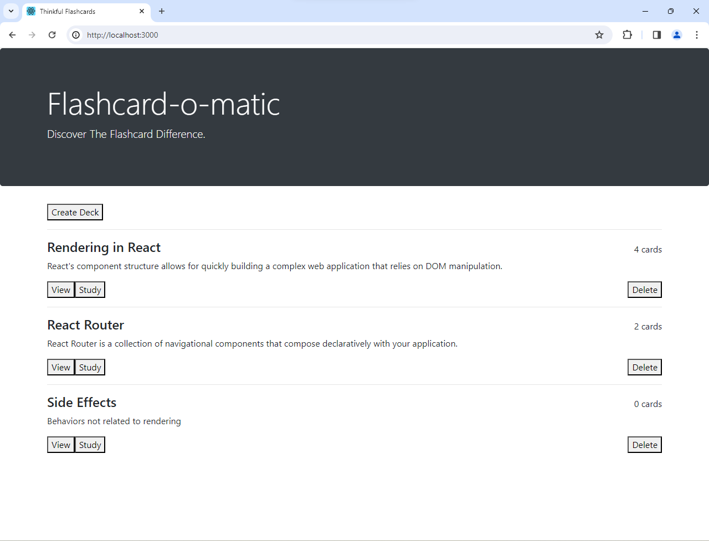

A deck can be deleted from within `Deck` view--after confirmation:

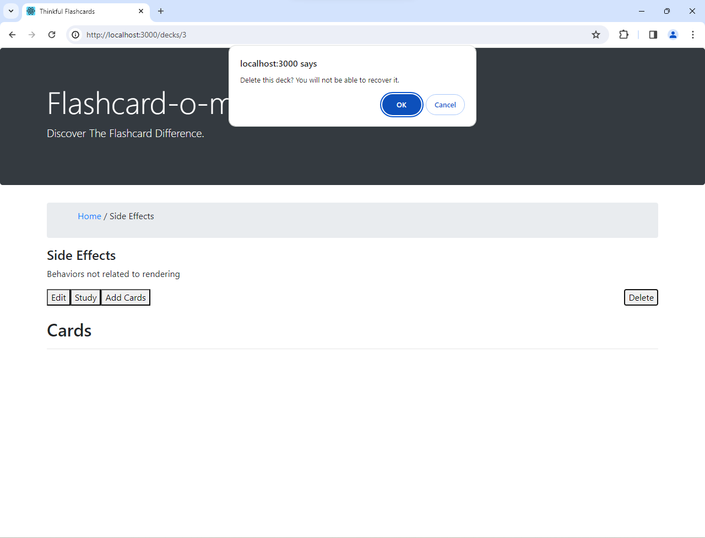

Or from Home--again, only after confirmation:

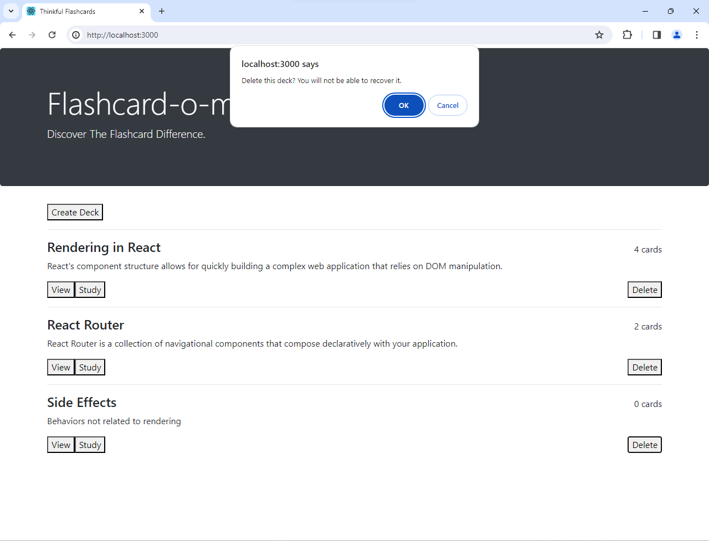

Having confirmed that choice, Home now displays as when we began the README screenshots: with two decks respectively containing four and two cards:

## Technology

### Built with:
* React and React Router
    * Created with [create-react-app](https://github.com/facebook/create-react-app)
    * Confirmation modal via [react-modal](https://github.com/reactjs/react-modal)
